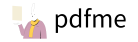

  
  

  
  
  
  

  <a href="https://lucide.dev/icons">Icons</a>
  ·
  <a href="https://lucide.dev/guide">Guide</a>
  ·
  <a href="https://lucide.dev/packages">Packages</a>
  ·
  <a href="https://lucide.dev/license">License</a>
  ·
  <a href="https://lucide.dev/showcase">Showcase</a>

# Lucide

Lucide is an open-source icon library featuring over 1,000 vector icons designed for easy integration across all kinds of projects. The library offers [official pacakges](https://lucide.dev/packages) for multiple frameworks, making it simple for developers and designers to incorporate high-quality, customizable icons into their work.

## Packages

| Logo                                                                                               | Package                   | Version                                                                                                                         | Downloads                                                                             | Links                                                                                                    |
| -------------------------------------------------------------------------------------------------- | ------------------------- | --------------------------------------------------------------------------------------------------------------------------------|-------------------------------------------------------------------------------------- | -------------------------------------------------------------------------------------------------------- |
|                      | **`lucide`**              |                            |               | [Docs](https://lucide.dev/guide/packages/lucide) · [Source](./packages/lucide)                           |
|                | **`lucide-react`**        |                |         | [Docs](https://lucide.dev/guide/packages/lucide-react) · [Source](./packages/lucide-react)               |
|                    | **`lucide-vue-next`**     |          |      | [Docs](https://lucide.dev/guide/packages/lucide-vue-next) · [Source](./packages/lucide-vue-next)         |
|              | **`lucide-svelte`**       |              |        | [Docs](https://lucide.dev/guide/packages/lucide-svelte) · [Source](./packages/lucide-svelte)             |
|                | **`lucide-solid`**        |                |         | [Docs](https://lucide.dev/guide/packages/lucide-solid) · [Source](./packages/lucide-solid)               |
|              | **`lucide-preact`**       |              |        | [Docs](https://lucide.dev/guide/packages/lucide-preact) · [Source](./packages/lucide-preact)             |
|  | **`lucide-react-native`** |  |  | [Docs](https://lucide.dev/guide/packages/lucide-react-native) · [Source](./packages/lucide-react-native) |
|            | **`lucide-angular`**      |            |       | [Docs](https://lucide.dev/guide/packages/lucide-angular) · [Source](./packages/lucide-angular)           |
|                    | **`lucide-static`**       |              |        | [Docs](https://lucide.dev/guide/packages/lucide-static) · [Source](./packages/lucide-static)             |

### Figma

Seamlessly integrate Lucide icons into your Figma designs with our official plugin.

Visit the [Figma community page](https://www.figma.com/community/plugin/939567362549682242/Lucide-Icons) to install the plugin.

## Contributing

Want to help improve Lucide? Check out our [contribution guidelines](CONTRIBUTING.md).

## Community

Connect with fellow Lucide enthusiasts on our [Discord server](https://discord.gg/EH6nSts)!

## License

Lucide is completely free for commercial and personal use, licensed under the [ISC License](https://github.com/lucide-icons/lucide/blob/main/LICENSE).

## Credits

A big thank you to all the [contributors](https://github.com/lucide-icons/lucide/graphs/contributors) who have helped shape Lucide!

## Sponsors

### Awesome backers

