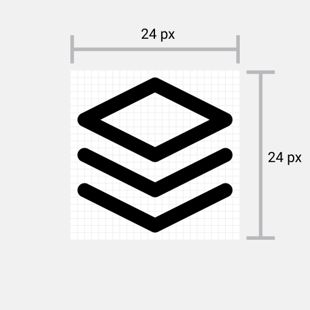
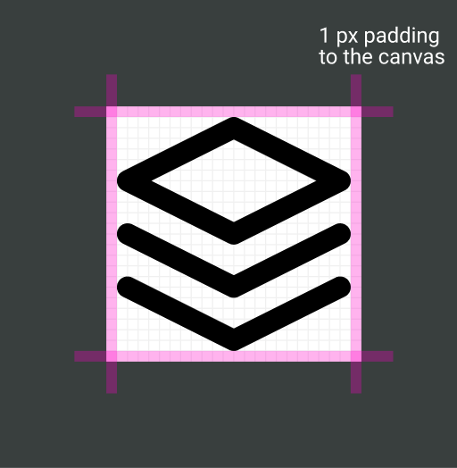
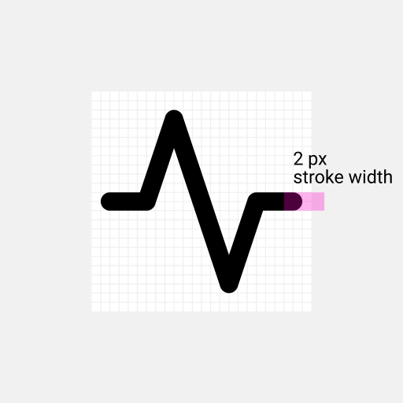
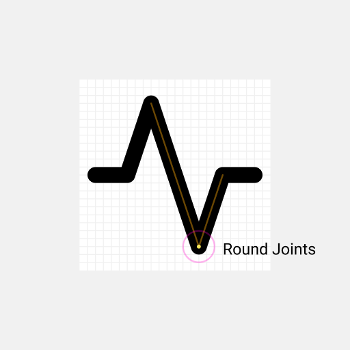
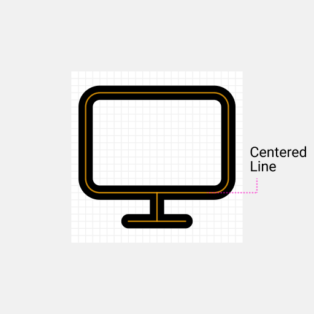
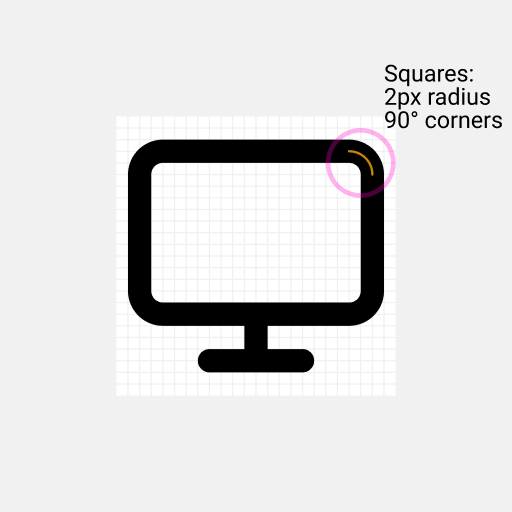
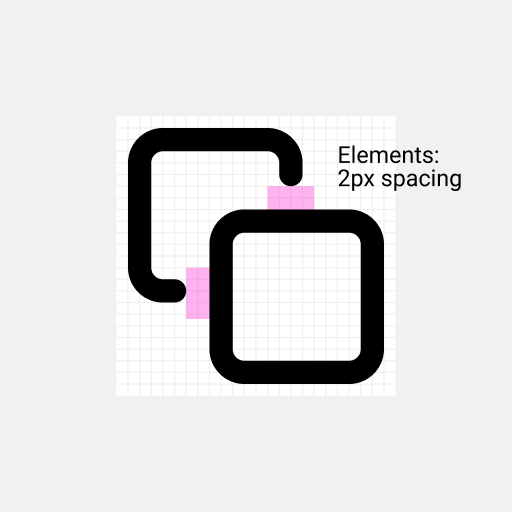

# Icon Degin Guide

To design icons for this icon library we need to follow some guidelines to match all the icons in the same style.

## Summary of the rules we have

1. Each Icon is desined on a canvas of **24 by 24 pixels**.
2. Each Icon have **1 pixel padding** between icon and the canvas.
3. Each icon has a **stroke width of 2 pixels**.
4. Each icon has **round joins**.
5. Each icon has **round caps**.
6. Each icon has **centered strokes**.
7. Each icon containing squares has a **border radius of 2 pixels**.
8. Each icon **2 pixels of spacing between elements**.

## The Rules Visualized

### 1. **Each Icon is desined on a canvas of 24 by 24 pixels**



### 2. **Each Icon have 1 pixel between icon and the canvas**



### 3. **Each icon has a stroke width of 2 pixels**



### 4. **Each icon has round joins**



### 5. **Each icon has round caps**


### 6. **Each icon has centered strokes**



### 7. **Each icon containing squares has a border radius of 2 pixels**



### 8. **Each icon 2 pixels of spaciong between elements**



## Code Conventions

Before an icon is added to the library, we like to have readable and optimized svg code.

### Global Attributes

For each icon these attributes are applied.

```xml
<svg
  xmlns="http://www.w3.org/2000/svg"
  width="24"
  height="24"
  viewBox="0 0 24 24"
  fill="none"
  stroke="currentColor"
  stroke-width="2"
  stroke-linecap="round"
  stroke-linejoin="round"
>
  <!-- SVGElements -->
</svg>
```

### Minify paths

Code of paths can get really big.
To reduce file size we like to minify the code.
We recommend to use the [SVGOMG](https://jakearchibald.github.io/svgomg/) to minify paths.
