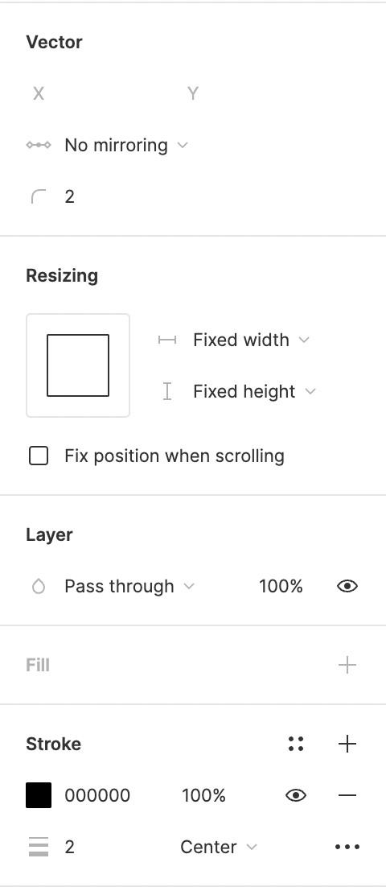

# Figma Template Guide

This guide shows the steps to setup Figma for creating icons that conform to the Featherity design guidelines.

## Setting Up The Frame
When you create a new document in Figma, the document. Each individual icon you want to create, has to be created in a separate frame.

To do this, create a frame of 24x24 pixels.

1. Click the frame button (or press `F`)
2. Draw a 24x24 frame (or edit it afterwards from the design window)

In this newly created frame, you will create your icon. If you want, you can change the name of your frame to the name of the icon you are going to create. Then it will be exported as `FRAME-NAME.svg`.

## Create Your icon
To design your icon in the style of Feather Icons, you need to adjust a few settings in Figma.

Draw in your new frame with the pen tool. You can open it with the window at the top, or with the shortcut `P`. Once you click in your frame, you can adjust the settings for the pen tool in the design-window on the right.

Set the following:
1. Vector
   1. Corner radius: 2px
2. Stroke
   1. Stroke width: 2px
   2. Stroke alignment: center

## Export Or Copy Your Icon
Once you have completed your icon, you can export it.

1. Select the frame
2. Open the *Export* tab on the right
3. Set the file type as SVG
4. Press export

Or you can also copy its source as SVG.

1. Select the frame
2. Right click it
3. Click on *Copy/Paste as*
4. Click on *Copy as SVG*

That's it. You just made your first icon. Congratulations!

## Figma Tips
1. The [Icon Design Guidelines](icon-design-guide.md) dictate that you keep 2px spacing between detached elements. In Figma, you can easily check this with: `⌥` Option (MacOS) or `Alt` (Windows).
