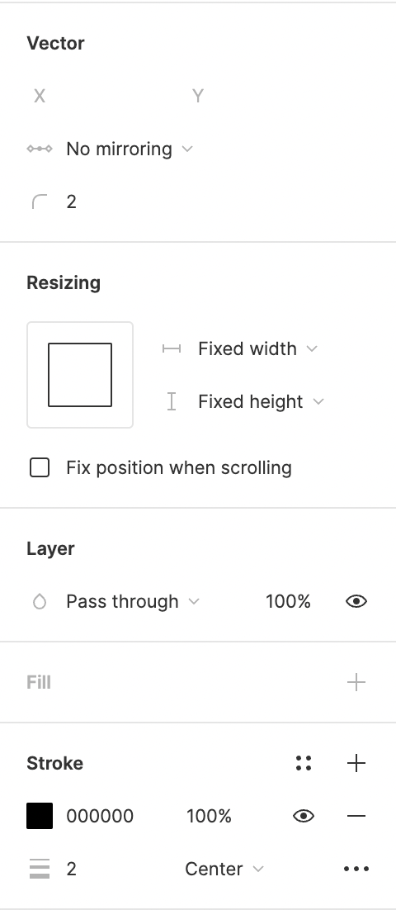

# Figma template guide

This guide shows how to set up Figma for Lucide icons.

## Set up the frame

Create each icon in its own frame.

Use a `24 × 24` pixel frame.

1. Click the frame button, or press `F`.
2. Draw a `24 × 24` frame, or set the size in the right sidebar.

Design the icon inside this frame. Name the frame after the icon so Figma exports it as `frame-name.svg`.

## Create your icon

Set up the stroke before drawing.

Draw in the frame with the pen tool. Open it from the toolbar or press `P`. After you start drawing, adjust the vector settings in the right sidebar.

Set the following:

1. Vector
   1. Corner radius: 2px
2. Stroke
   1. Stroke width: 2px
   2. Stroke alignment: center

## Export or copy your icon

When your icon is ready, export it.

1. Select the frame.
2. Open the _Export_ section in the right sidebar.
3. Set the file type to SVG.
4. Click _Export_.

You can also copy the SVG source.

1. Select the frame.
2. Right-click it.
3. Choose _Copy/Paste as_.
4. Choose _Copy as SVG_.

You now have an SVG to prepare for contribution.

## Optimize your icon

You can optimize the exported SVG with [Lucide Studio](https://studio.lucide.dev/).

## Check spacing in Figma

The [design language](design-principles.md) requires at least 2 pixels of spacing between separate elements. In Figma, hold `Option` on macOS or `Alt` on Windows to check spacing.
