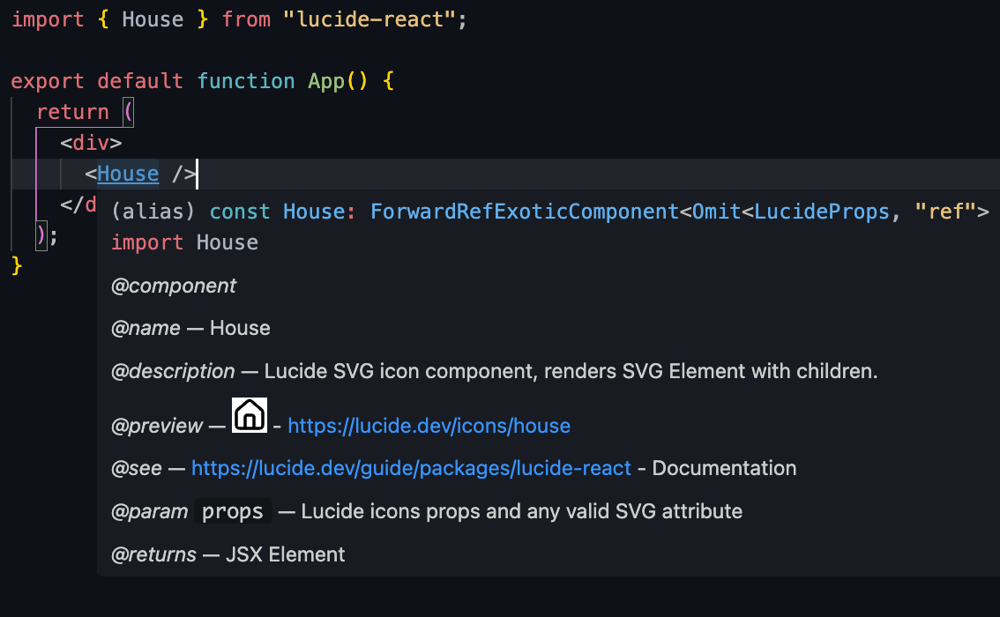

# Visual Studio Code

Visual Studio Code (VS Code) is a popular code editor that provides a wide range of features and extensions to enhance your development experience.

## Turn off autocomplete in your IDE

All icons are exported from the main module. This can create a lot of noise in the autocomplete suggestions of your IDE.
You can turn this off by adding the following setting to your VS Code settings.

```json [.vscode/settings.json]
{
  "typescript.preferences.autoImportFileExcludePatterns": [
    "lucide-react", // or
    "lucide-preact", // or
    "lucide-react-native", // or
    "lucide-vue-next",
  ]
}
```

## JS Docs and icon preview
Each icon is provided with JS docs. In VS Code, you can hover over the icon component to see the JSdocs.

Also a little preview of the icon is shown.



## Third party plugins

There are several third party plugins available for VS Code that provide additional features for working with Lucide icons.

See the  [VSCode Marketplace](https://marketplace.visualstudio.com/search?term=lucide&target=VSCode&category=All%20categories&sortBy=Relevance) for available extensions.
